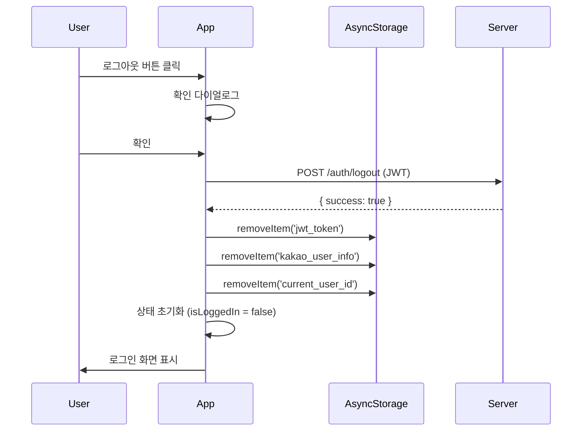

# Kakao Login & Subscription Agent Reference

## 개요
카카오 로그인 및 월 구독 기능 구현을 위한 서브 에이전트입니다.
앱하루는 로컬 SQLite 기반의 다묘 병상일지 앱으로, 사용자 식별 및 월 구독 결제를 위해 카카오 로그인을 필수로 합니다.

---

## 🎯 모듈화 구조 (병렬 처리 가능)

### Phase 1: 독립 모듈 (동시 작업 가능) ⚡

```
┌─────────────────────────────────────────────────────────────────────┐
│  Module A: DB Migration      │  Module B: Kakao SDK    │  Module C: UI Components  │
│  ────────────────────       │  ───────────────────   │  ─────────────────────────  │
│  • users 테이블 생성          │  • OAuth2 연동          │  • LoginScreen             │
│  • subscription_state 확장    │  • 토큰 관리            │  • SubscriptionStatus      │
│  • userId 컬럼 추가           │  • 세션 관리            │  • SubscriptionPopup       │
│  의존성: 없음                  │  의존성: 없음           │  의존성: 없음                │
└─────────────────────────────────────────────────────────────────────┘
```

### Phase 2: 서비스 모듈 (Phase 1 완료 후 동시 작업 가능)

```
┌─────────────────────────────────────────────────────────────────────┐
│  Module D: User Service              │  Module E: Subscription Service    │
│  ─────────────────────────          │  ──────────────────────────────   │
│  • loginWithKakao()                  │  • getSubscriptionStatus()         │
│  • logout()                          │  • startTrial()                    │
│  • getUser()                         │  • activateSubscription()          │
│  • updateLastLogin()                 │  • expireSubscription()            │
│  의존성: Module A, B                  │  의존성: Module A                   │
└─────────────────────────────────────────────────────────────────────┘
```

### Phase 3: 통합 (Phase 2 완료 후)

```
┌─────────────────────────────────────────────────────────────────────┐
│  Module F: Integration & Testing                                    │
│  ───────────────────────────────                                   │
│  • UI ↔ Service 연결                                                │
│  • 플로우 테스트                                                     │
│  • 예외 처리 검증                                                    │
│  의존성: Module C, D, E                                              │
└─────────────────────────────────────────────────────────────────────┘
```

---

## Module A: DB Migration

### 참조 파일
- `apps/mobile/services/migrations/migrationManager.ts`
- `apps/mobile/services/migrations/migrations.ts`

### 신규 파일
- `apps/mobile/services/migrations/v2_add_users_table.ts`

### 스키마 정의

#### users 테이블
```sql
CREATE TABLE IF NOT EXISTS users (
  id TEXT PRIMARY KEY,        -- 카카오 고유 ID
  nickname TEXT,              -- 카카오 닉네임
  profileImage TEXT,          -- 프로필 이미지 URL
  createdAt TEXT NOT NULL,    -- 최초 로그인 시각
  lastLogin TEXT NOT NULL     -- 마지막 로그인 시각
);
```

#### subscription_state 테이블 확장
```sql
ALTER TABLE subscription_state ADD COLUMN userId TEXT REFERENCES users(id);
```

#### 기존 테이블 userId 추가
```sql
-- 모든 데이터 테이블에 userId 컬럼 추가
ALTER TABLE pets ADD COLUMN userId TEXT;
ALTER TABLE daily_records ADD COLUMN userId TEXT;
ALTER TABLE supplements ADD COLUMN userId TEXT;
-- ... (나머지 테이블도 동일)
```

### 구현 체크리스트
- [ ] Migration 파일 생성 (`v2_add_users_table.ts`)
- [ ] `users` 테이블 생성 쿼리
- [ ] `subscription_state`에 `userId` 추가
- [ ] 기존 테이블에 `userId` 컬럼 추가
- [ ] Migration 등록 (`migrations.ts`에 추가)

---

## Module B: Kakao OAuth (Server-based)

### 아키텍처
**서버 경유 방식**: 앱 → 인증 코드 획득 → 서버로 전달 → 서버에서 토큰 발급 및 유저 정보 조회 → JWT 반환

```
┌─────────┐         ┌──────────┐         ┌────────────┐
│   앱    │ ──code→ │  서버    │ ──토큰→ │  카카오   │
│(Client)│ ←─JWT─  │(Backend) │ ←유저─  │(OAuth API)│
└─────────┘         └──────────┘         └────────────┘
```

### 수정 파일
- `apps/mobile/services/auth/kakaoAuth.ts`

### 패키지 설치
```bash
npx expo install expo-auth-session expo-web-browser
```

### 카카오 개발자 콘솔 설정
- **Redirect URI**: `https://myorok.haroo.site/auth/kakao` (서버 주소)
- **네이티브 앱 키**: 앱에서 OAuth 인증 시작용
- **REST API 키**: 서버에서 토큰 발급용
- **클라이언트 시크릿**: 서버에서 토큰 요청 시 사용 (활성화 필수)

### API 정의

```typescript
// apps/mobile/services/auth/kakaoAuth.ts

export interface KakaoUser {
  id: string;
  nickname: string;
  profileImage?: string;
}

export interface ServerAuthResponse {
  success: boolean;
  user: KakaoUser;
  token: string; // JWT for app-server auth
}

/**
 * 서버 기반 카카오 로그인
 * 1. useAuthRequest로 인증 코드 획득
 * 2. 서버로 code 전달
 * 3. 서버에서 JWT 받음
 */
export async function loginWithKakaoServer(code: string): Promise<ServerAuthResponse>;

/**
 * 카카오 로그아웃 (토큰 무효화는 서버에서 처리)
 */
export async function logoutFromKakao(): Promise<void>;

/**
 * 현재 인증 상태 확인 (로컬 JWT 기반)
 */
export async function getAuthSession(): Promise<KakaoUser | null>;
```

### 구현 체크리스트
- [ ] expo-auth-session 설치
- [ ] 카카오 Redirect URI를 서버 주소로 변경
- [ ] `loginWithKakaoServer(code)` 구현 (서버 POST /auth/kakao)
- [ ] `logoutFromKakao()` 구현 (서버 POST /auth/logout)
- [ ] JWT 저장 및 관리 (AsyncStorage)
- [ ] 에러 핸들링

---

## Module C: UI Components

### 신규 파일
- `apps/mobile/components/auth/LoginScreen.tsx`
- `apps/mobile/components/subscription/SubscriptionStatus.tsx`
- `apps/mobile/components/subscription/SubscriptionPopup.tsx`

### LoginScreen

```typescript
// apps/mobile/components/auth/LoginScreen.tsx

interface LoginScreenProps {
  onLoginSuccess: (userId: string) => void;
}

/**
 * 로그인 화면 컴포넌트
 * - 카카오 로그인 버튼 (노란색, 카카오 디자인 가이드 준수)
 * - 안내 문구: "월 구독 결제로 앱하루를 이용하려면 로그인하세요."
 */
export function LoginScreen({ onLoginSuccess }: LoginScreenProps): JSX.Element;
```

### SubscriptionStatus

```typescript
// apps/mobile/components/subscription/SubscriptionStatus.tsx

interface SubscriptionStatusProps {
  status: 'trial' | 'active' | 'expired';
  daysRemaining?: number;
  expiryDate?: string;
  onSubscribe?: () => void;
}

/**
 * 구독 상태 표시 컴포넌트
 * - trial: "무료 체험 중 (N일 남음)"
 * - active: "구독 중 (YYYY-MM-DD까지)"
 * - expired: "구독 만료" + 결제 유도 버튼
 */
export function SubscriptionStatus(props: SubscriptionStatusProps): JSX.Element;
```

### SubscriptionPopup

```typescript
// apps/mobile/components/subscription/SubscriptionPopup.tsx

interface SubscriptionPopupProps {
  visible: boolean;
  onSubscribe: () => void;
  onDismiss: () => void;
}

/**
 * 구독 만료 팝업 컴포넌트
 * - "구독하기" / "나중에" 버튼
 */
export function SubscriptionPopup(props: SubscriptionPopupProps): JSX.Element;
```

### 구현 체크리스트
- [ ] LoginScreen 레이아웃 구현
- [ ] 카카오 로그인 버튼 스타일링
- [ ] SubscriptionStatus 컴포넌트 구현
- [ ] SubscriptionPopup 컴포넌트 구현

---

## Module D: User Service (Server-based)

### 수정 파일
- `apps/mobile/services/auth/userService.ts`

### API 정의

```typescript
// apps/mobile/services/auth/userService.ts

export interface User {
  id: string;
  nickname: string;
  profileImage?: string;
  createdAt: string;
  lastLogin: string;
}

/**
 * 카카오 로그인 수행
 * - 서버로 인증 코드 전달
 * - JWT 및 사용자 정보 수신
 * - 로컬 DB에 사용자 정보 저장 (신규/기존 구분)
 */
export async function loginWithKakao(code: string): Promise<string>;

/**
 * 로그아웃
 * - 서버로 로그아웃 요청 (JWT 무효화)
 * - 로컬 JWT 및 userId 제거
 * - 로컬 pet 데이터 유지
 */
export async function logout(): Promise<void>;

/**
 * 사용자 정보 조회 (로컬 DB)
 */
export async function getUser(userId: string): Promise<User | null>;

/**
 * 마지막 로그인 시각 갱신 (로컬 DB)
 */
export async function updateLastLogin(userId: string): Promise<void>;

/**
 * 현재 로그인된 사용자 ID 조회 (JWT 기반)
 */
export async function getCurrentUserId(): Promise<string | null>;
```

### 서버 API 연동
- **POST /auth/kakao**: 인증 코드를 서버로 전달, JWT 및 사용자 정보 반환
- **POST /auth/logout**: JWT 무효화 요청

### 구현 체크리스트
- [ ] `loginWithKakao(code)` 구현 (Module B 사용)
- [ ] 서버에서 받은 JWT를 AsyncStorage에 저장
- [ ] 로컬 DB에 사용자 정보 저장 또는 업데이트
- [ ] `logout()` 구현 (서버 로그아웃 + 로컬 정리)
- [ ] `getUser()` 구현 (Module A 사용)
- [ ] `updateLastLogin()` 구현
- [ ] `getCurrentUserId()` 구현 (JWT 디코딩 또는 AsyncStorage)

---

## Module E: Subscription Service

### 수정 파일
- `apps/mobile/services/subscription.ts` (기존 파일 확장)

### API 정의 (추가)

```typescript
// apps/mobile/services/subscription.ts 확장

/**
 * 사용자별 구독 상태 조회
 */
export async function getSubscriptionStatusForUser(userId: string): Promise<SubscriptionState>;

/**
 * 무료 체험 시작 (사용자별)
 */
export async function startTrialForUser(userId: string): Promise<void>;

/**
 * 구독 활성화 (사용자별)
 */
export async function activateSubscriptionForUser(
  userId: string,
  startDate: string,
  expiryDate: string
): Promise<void>;

/**
 * 구독 만료 처리 (사용자별)
 */
export async function expireSubscriptionForUser(userId: string): Promise<void>;
```

### 구현 체크리스트
- [ ] 기존 함수에 userId 파라미터 추가
- [ ] `getSubscriptionStatusForUser()` 구현
- [ ] `startTrialForUser()` 구현
- [ ] `activateSubscriptionForUser()` 구현
- [ ] `expireSubscriptionForUser()` 구현

---

## Module F: Integration

### 수정 파일
- `apps/mobile/app/_layout.tsx` (앱 진입점)
- `apps/mobile/app/(tabs)/settings/index.tsx` (설정 페이지)

### 플로우 구현

#### 앱 실행 플로우
```
앱 실행 → getCurrentUserId() 확인
  ↓
[null] → LoginScreen 표시
[userId] → getSubscriptionStatusForUser(userId) 확인
  ↓
[expired] → SubscriptionPopup 표시
[trial/active] → 메인 화면 진입
```

#### 로그인 플로우
```
LoginScreen → loginWithKakao()
  ↓
[신규] → startTrialForUser(userId)
[기존] → updateLastLogin(userId)
  ↓
메인 화면 이동
```

### 구현 체크리스트
- [ ] _layout.tsx에 인증 상태 체크 추가
- [ ] 로그인 화면 라우팅 추가
- [ ] 설정 페이지에 SubscriptionStatus 추가
- [ ] 로그아웃 버튼 추가
- [ ] 구독 만료 팝업 연동

---

## 예외 처리

| 상황 | 처리 |
|------|------|
| 카카오 로그인 실패 | Alert: "로그인에 실패했습니다. 다시 시도해주세요." |
| 네트워크 오류 | Alert: "네트워크 연결을 확인해주세요." |
| DB 마이그레이션 실패 | 로그 기록 + 이전 버전 유지 |
| 구독 상태 불일치 | 로컬 DB 재동기화 |

---

## 보안 정책

- 카카오 OAuth2 표준 준수
- 로컬 DB 암호화 권장 (expo-secure-store)
- 개인정보 최소화: ID, 닉네임, 프로필 이미지만 저장
- 로그아웃 시 userId 제거, 구독/데이터 접근 차단

---

## 🚪 로그아웃 기능 상세

### 목표
- 사용자가 로그아웃 시 **저장된 토큰을 삭제**
- 로그인 화면으로 즉시 복귀
- 앱 내 다른 데이터(예: 로컬 캐시, pet 데이터 등)는 유지

### 저장 데이터 및 처리

| 데이터 | 저장 위치 | 키 | 처리 방식 |
|--------|-----------|-----|-----------|
| JWT 토큰 | AsyncStorage | `jwt_token` | ✅ 삭제 |
| Access Token (레거시) | AsyncStorage | `kakao_access_token` | ✅ 삭제 |
| Refresh Token (레거시) | AsyncStorage | `kakao_refresh_token` | ✅ 삭제 |
| 사용자 정보 | AsyncStorage | `kakao_user_info` | ✅ 삭제 |
| 현재 사용자 ID | AsyncStorage | `current_user_id` | ✅ 삭제 |
| Pet 데이터 | SQLite | - | ❌ 유지 |
| 기록 데이터 | SQLite | - | ❌ 유지 |

### 로그아웃 플로우



### 구현 코드

#### kakaoAuth.ts
```typescript
export async function logoutFromKakao(): Promise<void> {
    try {
        const jwtToken = await AsyncStorage.getItem(STORAGE_KEYS.JWT_TOKEN);

        if (jwtToken) {
            // Call server logout API (optional - JWT is stateless)
            await fetch(`${SERVER_URL}/auth/logout`, {
                method: 'POST',
                headers: {
                    'Authorization': `Bearer ${jwtToken}`,
                    'Content-Type': 'application/json',
                },
            });
        }

        // Clear all auth-related storage
        await AsyncStorage.multiRemove([
            STORAGE_KEYS.JWT_TOKEN,
            STORAGE_KEYS.USER_INFO,
            STORAGE_KEYS.ACCESS_TOKEN,
            STORAGE_KEYS.REFRESH_TOKEN,
        ]);

        console.log('[KakaoAuth] Logout successful');
    } catch (error) {
        console.error('[KakaoAuth] Logout error:', error);
        // Still clear local storage on error
        await AsyncStorage.multiRemove([
            STORAGE_KEYS.JWT_TOKEN,
            STORAGE_KEYS.USER_INFO,
            STORAGE_KEYS.ACCESS_TOKEN,
            STORAGE_KEYS.REFRESH_TOKEN,
        ]);
    }
}
```

#### userService.ts
```typescript
export async function logout(): Promise<void> {
    try {
        await logoutFromKakao();
        await AsyncStorage.removeItem(STORAGE_KEYS.CURRENT_USER_ID);
        console.log('[UserService] User logged out');
    } catch (error) {
        console.error('[UserService] Logout failed:', error);
        throw error;
    }
}
```

### UI/UX

- **버튼 위치**: 설정 화면 하단 (눈에 잘 안 띄게)
- **스타일**: 회색 텍스트, 작은 폰트
- **확인 다이얼로그**:
  ```
  [로그아웃]
  "정말 로그아웃하시겠습니까?"
  [취소] [로그아웃]
  ```
- **로그아웃 완료**: Alert 표시 후 로그인 화면으로 이동

### 주의사항

1. **토큰 삭제 후에도 로컬 데이터 유지**: Pet, 기록 등은 삭제하지 않음
2. **앱 재시작 권장**: Development Build에서는 `expo-updates` 미지원
3. **서버 로그아웃 실패 시에도 로컬 정리**: 네트워크 오류 시에도 로컬 토큰 삭제

---

## 파일 구조 요약

```
apps/mobile/
├── services/
│   ├── auth/
│   │   ├── kakaoAuth.ts        # [B] 카카오 SDK 연동
│   │   └── userService.ts      # [D] 사용자 관리
│   ├── subscription.ts         # [E] 구독 관리 (확장)
│   └── migrations/
│       └── v2_add_users_table.ts  # [A] DB 마이그레이션
├── components/
│   ├── auth/
│   │   └── LoginScreen.tsx     # [C] 로그인 UI
│   └── subscription/
│       ├── SubscriptionStatus.tsx   # [C] 구독 상태
│       └── SubscriptionPopup.tsx    # [C] 구독 팝업
└── app/
    ├── _layout.tsx             # [F] 인증 체크 (수정)
    └── (tabs)/settings/
        └── index.tsx           # [F] 구독 상태 표시 (수정)
```

---

## 작업 순서 권장

### 🟢 Phase 1 (병렬 가능: 3명 동시 작업)
1. **Module A** 담당: DB 마이그레이션
2. **Module B** 담당: 카카오 SDK 연동
3. **Module C** 담당: UI 컴포넌트 (껍데기)

### 🟡 Phase 2 (병렬 가능: 2명 동시 작업)
4. **Module D** 담당: 사용자 관리 서비스
5. **Module E** 담당: 구독 관리 서비스

### 🔵 Phase 3
6. **Module F** 담당: 통합 및 테스트

---

## 서버 API 스펙

### 1. POST /auth/kakao
**카카오 OAuth 인증 코드를 서버로 전달하여 JWT 획득**

**Request**
```json
{
  "code": "KAKAO_AUTH_CODE"
}
```

**Response (Success)**
```json
{
  "success": true,
  "user": {
    "id": "1234567890",
    "nickname": "홍길동",
    "profileImage": "https://..."
  },
  "token": "JWT_TOKEN_HERE"
}
```

**Response (Error)**
```json
{
  "success": false,
  "error": "토큰 발급에 실패했습니다."
}
```

**서버 처리 로직**
1. 인증 코드로 카카오 OAuth 토큰 발급 (클라이언트 시크릿 사용)
2. 카카오 API로 사용자 정보 조회
3. JWT 생성 (userId 포함)
4. 응답 반환

### 2. POST /auth/logout
**JWT 무효화 요청**

**Request Headers**
```
Authorization: Bearer JWT_TOKEN
```

**Response**
```json
{
  "success": true
}
```

**서버 처리 로직**
1. JWT 검증
2. 카카오 로그아웃 API 호출 (옵션)
3. JWT를 블랙리스트에 추가 또는 Redis에서 삭제

---

## 환경 변수

### 앱 (.env 또는 app.json)
```bash
EXPO_PUBLIC_KAKAO_NATIVE_APP_KEY=your_kakao_native_app_key
EXPO_PUBLIC_SERVER_URL=https://myorok.haroo.site
```

### 서버 (backend/.env)
```bash
KAKAO_REST_API_KEY=your_kakao_rest_api_key
KAKAO_CLIENT_SECRET=your_kakao_client_secret
KAKAO_REDIRECT_URI=https://myorok.haroo.site/auth/kakao
JWT_SECRET=your_jwt_secret
```

---

## 참조 문서

- [KAKAO_LOGIN_SUBSCRIPTION_SPEC.md](file:///Users/shkim/Desktop/Project/myorok/docs/planning/KAKAO_LOGIN_SUBSCRIPTION_SPEC.md)
- [LOCAL_DB_SPEC.md](file:///Users/shkim/Desktop/Project/myorok/docs/planning/LOCAL_DB_SPEC.md)
- [카카오 로그인 배포용 구현 가이드](#user-provided)
