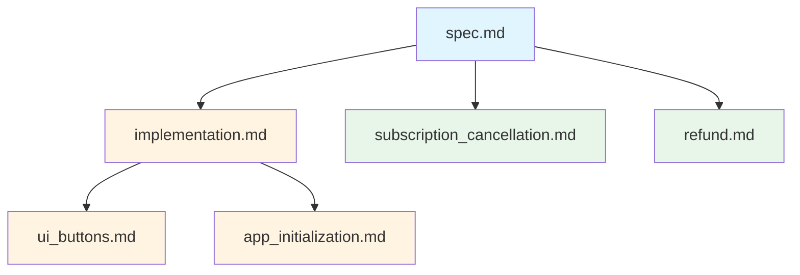

# Payment System Documentation

> 결제 시스템 구현을 위한 모듈화된 문서

## 📁 모듈 구조

이 폴더는 Google Play 결제 시스템을 **병렬로 작업 가능하도록** 독립적인 모듈로 분리한 문서를 포함합니다.

### 모듈 목록

| 모듈 | 파일 | 목적 | 독립성 |
|------|------|------|--------|
| **Planning** | [spec.md](file:///Users/shkim/Desktop/Project/myorok/docs/sub_agents_docs/features/payment/spec.md) | 결제 스펙 참조 문서 | ✅ 완전 독립 |
| **핵심 구현** | [implementation.md](file:///Users/shkim/Desktop/Project/myorok/docs/sub_agents_docs/features/payment/implementation.md) | 결제 로직 및 샌드박스 테스트 | ✅ 완전 독립 |
| **UI 버튼** | [ui_buttons.md](file:///Users/shkim/Desktop/Project/myorok/docs/sub_agents_docs/features/payment/ui_buttons.md) | 결제 버튼 UI 구현 | ⚠️ implementation 의존 |
| **앱 초기화** | [app_initialization.md](file:///Users/shkim/Desktop/Project/myorok/docs/sub_agents_docs/features/payment/app_initialization.md) | 앱 시작 시 초기화 | ⚠️ implementation 의존 |
| **구독 해지** | [subscription_cancellation.md](file:///Users/shkim/Desktop/Project/myorok/docs/sub_agents_docs/features/payment/subscription_cancellation.md) | 구독 해지 UI | ✅ 완전 독립 |
| **환불** | [refund.md](file:///Users/shkim/Desktop/Project/myorok/docs/sub_agents_docs/features/payment/refund.md) | 환불 UI | ✅ 완전 독립 |

---

## 🚀 병렬 작업 가이드

### Phase 1: 병렬 실행 가능 (우선순위)

다음 모듈은 **동시에 병렬로 작업 가능**합니다:

1. **[implementation.md](file:///Users/shkim/Desktop/Project/myorok/docs/sub_agents_docs/features/payment/implementation.md)** - 핵심 결제 로직
2. **[subscription_cancellation.md](file:///Users/shkim/Desktop/Project/myorok/docs/sub_agents_docs/features/payment/subscription_cancellation.md)** - 구독 해지 UI
3. **[refund.md](file:///Users/shkim/Desktop/Project/myorok/docs/sub_agents_docs/features/payment/refund.md)** - 환불 UI

### Phase 2: 의존성 작업 (순차 실행)

`implementation.md` 완료 후 병렬 실행 가능:

4. **[ui_buttons.md](file:///Users/shkim/Desktop/Project/myorok/docs/sub_agents_docs/features/payment/ui_buttons.md)** - 결제 버튼 UI
5. **[app_initialization.md](file:///Users/shkim/Desktop/Project/myorok/docs/sub_agents_docs/features/payment/app_initialization.md)** - 앱 초기화

---

## 📖 각 모듈 설명

### 1. spec.md (Planning 문서)
- PAYMENT_SPEC.md의 전체 내용
- 읽기 전용 참조 문서
- 모든 에이전트가 참조할 수 있는 단일 소스

### 2. implementation.md (핵심 구현)
**담당 에이전트**: BackendAgent / PaymentImplementationAgent

**작업 내용**:
- Google Play Console 샌드박스 환경 구성
- `paymentService.ts` 구현
- `licenseChecker.ts` 구현 (License Response 처리)
- `subscription.ts` 확장
- 샌드박스 테스트 시나리오 실행

**출력 파일**:
- `apps/mobile/services/paymentService.ts`
- `apps/mobile/services/licenseChecker.ts`
- `apps/mobile/services/subscription.ts` (확장)

### 3. ui_buttons.md (UI 버튼)
**담당 에이전트**: FrontendAgent / UIAgent

**작업 내용**:
- "구독 시작 / 결제하기" 버튼 구현
- "무료 체험 시작" 버튼 구현
- 결제 모달/창 구현
- 상태별 UI 분기
- 에러 메시지 토스트/Alert

**출력 파일**:
- `apps/mobile/app/(tabs)/settings/pro.tsx` (수정)
- `apps/mobile/components/payment/SubscriptionButton.tsx` (신규)

### 4. app_initialization.md (앱 초기화)
**담당 에이전트**: AppLifecycleAgent / InitializationAgent

**작업 내용**:
- `_layout.tsx`에 결제 초기화 로직 추가
- useEffect 구현
- cleanup 로직 구현

**출력 파일**:
- `apps/mobile/app/_layout.tsx` (수정)

### 5. subscription_cancellation.md (구독 해지)
**담당 에이전트**: UIAgent / SettingsAgent

**작업 내용**:
- 구독 해지 링크 UI 구현
- Google Play 구독 관리 페이지 연결
- 스타일 적용

**출력 파일**:
- `apps/mobile/app/(tabs)/settings/pro.tsx` (수정)

### 6. refund.md (환불)
**담당 에이전트**: UIAgent / PolicyAgent

**작업 내용**:
- 환불 안내 UI 구현
- Google Play 정책 준수
- 링크 처리

**출력 파일**:
- `apps/mobile/app/(tabs)/settings/pro.tsx` (수정)

---

## 🔄 의존성 관계

- **파란색**: 참조 문서
- **주황색**: 백엔드/로직
- **초록색**: 독립 UI

---

## ✅ 작업 순서 추천

1. **먼저 읽기**: [spec.md](file:///Users/shkim/Desktop/Project/myorok/docs/sub_agents_docs/features/payment/spec.md)
2. **병렬 시작**:
   - Agent 1: [implementation.md](file:///Users/shkim/Desktop/Project/myorok/docs/sub_agents_docs/features/payment/implementation.md)
   - Agent 2: [subscription_cancellation.md](file:///Users/shkim/Desktop/Project/myorok/docs/sub_agents_docs/features/payment/subscription_cancellation.md)
   - Agent 3: [refund.md](file:///Users/shkim/Desktop/Project/myorok/docs/sub_agents_docs/features/payment/refund.md)
3. **implementation 완료 후**:
   - Agent 4: [ui_buttons.md](file:///Users/shkim/Desktop/Project/myorok/docs/sub_agents_docs/features/payment/ui_buttons.md)
   - Agent 5: [app_initialization.md](file:///Users/shkim/Desktop/Project/myorok/docs/sub_agents_docs/features/payment/app_initialization.md)

---

## 📝 참고

- 원본 문서: [PaymentAgent.md](file:///Users/shkim/Desktop/Project/myorok/docs/sub_agents_docs/features/PaymentAgent.md)
- Planning 문서: [PAYMENT_SPEC.md](file:///Users/shkim/Desktop/Project/myorok/docs/planning/PAYMENT_SPEC.md)
